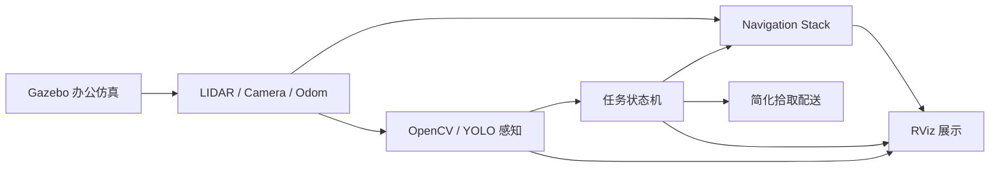

# 办公环境自主移动机器人 + 语义感知

本项目是一个面向简历作品集的 ROS1 仿真项目。目标是在办公环境中实现自主移动机器人 demo：机器人在 Gazebo 中完成室内导航、目标识别、任务触发、简化拾取与配送，并通过 RViz 展示路径、感知结果和任务状态。

## 项目亮点

- 基于 ROS1 Noetic、Gazebo Classic、RViz 和 TurtleBot3 Waffle Pi。
- 使用 ROS Navigation Stack 实现多目标点导航、避障和返回起点。
- 使用 OpenCV 快速跑通目标识别流程，后续升级 YOLOv8n。
- 使用 ROS topic 串联感知、任务管理和导航模块。
- 通过状态机实现“发现目标 -> 前往目标 -> 简化拾取 -> 送达 -> 返回起点”的完整闭环。
- 面向作品集整理文档、截图、录屏和 Git 提交记录。

## 技术栈

| 类型 | 技术 |
| --- | --- |
| 系统 | Ubuntu 20.04 |
| ROS | ROS1 Noetic |
| 仿真 | Gazebo Classic |
| 可视化 | RViz |
| 机器人模型 | TurtleBot3 Waffle Pi |
| 语言 | Python 3 |
| 感知 | OpenCV / YOLOv8n |
| 构建 | catkin_make |
| 版本管理 | Git |

## 目标 Demo

首版 demo 的运行流程：

1. Gazebo 启动办公环境和 TurtleBot3。
2. RViz 显示地图、机器人、路径和传感器数据。
3. 机器人在办公环境中自主导航并避障。
4. 相机识别瓶子、文件夹或箱子等目标物体。
5. 识别结果发布到 ROS topic，触发任务管理节点。
6. 机器人前往目标附近，模拟拾取。
7. 机器人将目标送到指定区域，模拟放置。
8. 任务完成后返回起点。

## 架构概览



核心节点：

- `navigation_manager_node`：多目标点导航、回起点、失败处理。
- `perception_node`：订阅相机图像，发布目标检测结果。
- `task_manager_node`：接收检测结果，编排导航、拾取、配送任务。
- `visualization_node`：发布 RViz Marker 和调试信息。

核心 Topic：

- `/camera/rgb/image_raw`
- `/detected_objects`
- `/task_command`
- `/task_state`
- `/move_base/goal`
- `/move_base/result`

## 仓库结构

当前仓库先建立文档，后续按以下结构补充 ROS package：

```text
.
├── README.md
├── docs/
│   ├── 项目开发文档.md
│   ├── 架构文档.md
│   └── 路线图.md
├── src/
│   ├── office_robot_sim/
│   ├── office_robot_navigation/
│   ├── office_robot_perception/
│   ├── office_robot_task/
│   └── office_robot_visualization/
├── assets/
│   ├── screenshots/
│   └── videos/
└── scripts/
```

## 运行方式

当前阶段尚未生成 ROS 代码。后续完整 demo 预计使用以下命令启动：

```bash
roslaunch office_robot_sim office_world.launch
roslaunch office_robot_navigation navigation.launch
roslaunch office_robot_perception perception.launch
roslaunch office_robot_task task_demo.launch
roslaunch office_robot_visualization visualization.launch
```

最终会提供一键启动入口：

```bash
roslaunch office_robot_task full_demo.launch
```

## 开发路线

1. 环境搭建与仓库初始化。
2. Gazebo 办公场景。
3. ROS Navigation Stack 自主导航。
4. OpenCV/YOLO 语义感知。
5. 任务执行与简化抓取。
6. 作品集整理与演示录屏。

详细内容见：

- [项目开发文档](docs/项目开发文档.md)
- [架构文档](docs/架构文档.md)
- [路线图](docs/路线图.md)

## 阶段成果记录

后续开发过程中在这里补充截图和视频：

- Gazebo 办公场景截图：待补充。
- RViz 导航截图：待补充。
- 目标检测截图：待补充。
- 完整任务 demo 视频：待补充。

## 当前状态

- 已完成项目需求整理。
- 已完成项目开发文档、架构文档和路线图。
- 下一步是搭建 Ubuntu 20.04 + ROS Noetic 开发环境，并初始化 ROS catkin 工作空间。
