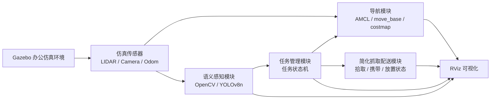
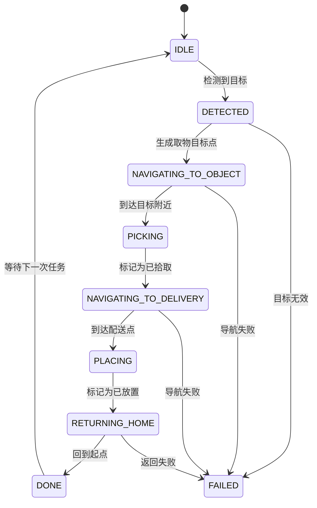

# 办公环境自主移动机器人架构文档

## 1. 架构目标

本架构面向 ROS1 Noetic 仿真项目，目标是让机器人在 Gazebo 办公环境中完成自主导航、语义感知、任务编排和简化拾取配送。架构设计优先保证首版 demo 稳定可运行，同时保留后续接入真实机器人、机械臂或更强感知模型的空间。

## 2. 总体架构



数据流：

1. Gazebo 发布机器人传感器数据。
2. 导航模块根据地图、定位和目标点规划路径。
3. 感知模块从相机图像中识别目标物体。
4. 任务管理模块根据识别结果触发导航和简化抓取。
5. 可视化模块将路径、目标、任务状态发布到 RViz。

## 3. ROS Package 划分

```text
src/
  office_robot_sim/
    launch/
    worlds/
    models/
  office_robot_navigation/
    launch/
    config/
    maps/
    scripts/
  office_robot_perception/
    launch/
    scripts/
    config/
  office_robot_task/
    launch/
    scripts/
    config/
  office_robot_visualization/
    launch/
    scripts/
```

### 3.1 `office_robot_sim`

职责：

- 管理 Gazebo world。
- 放置 TurtleBot3 Waffle Pi。
- 放置办公桌、障碍物、目标物体。
- 配置仿真相机和激光雷达。

主要输出：

- `/scan`
- `/camera/rgb/image_raw`
- `/odom`
- `/tf`

### 3.2 `office_robot_navigation`

职责：

- 启动地图、定位和导航。
- 配置 `move_base`、代价地图、局部规划器。
- 封装多目标点导航、失败重试、回起点。

核心节点：

- `navigation_manager_node`

订阅：

- `/move_base/result`
- `/amcl_pose`

发布：

- `/move_base/goal`
- `/navigation_state`

### 3.3 `office_robot_perception`

职责：

- 订阅仿真相机图像。
- 识别办公目标物体。
- 发布结构化检测结果。

核心节点：

- `perception_node`

订阅：

- `/camera/rgb/image_raw`

发布：

- `/detected_objects`
- `/perception/debug_image`

首版检测方案：

- 快速跑通阶段：OpenCV 颜色、形状或模板规则。
- 展示增强阶段：YOLOv8n 预训练或少量自定义数据微调。

### 3.4 `office_robot_task`

职责：

- 接收目标识别结果。
- 根据任务状态调用导航模块。
- 管理简化拾取、配送、返回起点。

核心节点：

- `task_manager_node`

订阅：

- `/detected_objects`
- `/navigation_state`

发布：

- `/task_command`
- `/task_state`
- `/target_goal`

任务状态：

```text
IDLE
DETECTED
NAVIGATING_TO_OBJECT
PICKING
NAVIGATING_TO_DELIVERY
PLACING
RETURNING_HOME
DONE
FAILED
```

### 3.5 `office_robot_visualization`

职责：

- 发布 RViz Marker。
- 展示目标物体、配送点、任务状态、模拟抓取状态。
- 辅助调试完整 demo。

核心节点：

- `visualization_node`

订阅：

- `/detected_objects`
- `/task_state`
- `/navigation_state`

发布：

- `/visualization_marker`
- `/visualization_marker_array`

## 4. Topic 设计

| Topic | 类型建议 | 发布方 | 订阅方 | 说明 |
| --- | --- | --- | --- | --- |
| `/camera/rgb/image_raw` | `sensor_msgs/Image` | Gazebo camera | `perception_node` | 相机图像 |
| `/scan` | `sensor_msgs/LaserScan` | Gazebo lidar | `move_base` | 激光雷达 |
| `/odom` | `nav_msgs/Odometry` | Gazebo/TurtleBot3 | navigation | 里程计 |
| `/move_base/goal` | `move_base_msgs/MoveBaseActionGoal` | navigation/task | `move_base` | 导航目标 |
| `/move_base/result` | `move_base_msgs/MoveBaseActionResult` | `move_base` | navigation/task | 导航结果 |
| `/detected_objects` | 自定义消息或 `std_msgs/String` 首版 | `perception_node` | `task_manager_node` | 检测结果 |
| `/task_command` | `std_msgs/String` 首版 | user/task | `task_manager_node` | 任务命令 |
| `/task_state` | `std_msgs/String` 首版 | `task_manager_node` | RViz/debug | 任务状态 |
| `/navigation_state` | `std_msgs/String` 首版 | `navigation_manager_node` | `task_manager_node` | 导航状态 |
| `/visualization_marker` | `visualization_msgs/Marker` | visualization/task | RViz | 可视化标记 |

首版可以使用 `std_msgs/String` 降低开发成本。项目稳定后，再把 `/detected_objects` 升级为自定义消息：

```text
string class_name
float32 confidence
float32 center_x
float32 center_y
float32 width
float32 height
time stamp
```

## 5. 任务流程



## 6. 导航设计

导航模块使用 ROS Navigation Stack：

- `map_server` 加载办公地图。
- `amcl` 完成定位。
- `move_base` 完成全局路径规划和局部避障。
- 全局代价地图使用静态地图和膨胀层。
- 局部代价地图使用激光雷达障碍物层。

首版目标点建议写入 YAML：

```yaml
home:
  x: 0.0
  y: 0.0
  yaw: 0.0
pickup_zone:
  x: 2.0
  y: 1.0
  yaw: 1.57
delivery_zone:
  x: -1.5
  y: 2.0
  yaw: 3.14
```

## 7. 感知设计

感知模块分两步实现：

### 7.1 OpenCV 快速闭环

用途：快速验证 ROS 图像订阅、检测结果发布和任务触发。

策略：

- 在 Gazebo 中使用颜色明显的目标物体。
- 用 HSV 阈值、轮廓面积和中心点计算识别目标。
- 发布目标类别、置信度占位和图像坐标。

### 7.2 YOLOv8n 展示增强

用途：提升作品集展示效果。

策略：

- 使用轻量 YOLOv8n。
- 先尝试预训练类别，例如 bottle。
- 如需识别文件夹、箱子，补充少量仿真截图进行自定义训练或使用替代类别。

## 8. 简化抓取设计

首版不实现真实机械臂。任务管理节点在机器人到达目标点后执行：

1. 将任务状态切换为 `PICKING`。
2. 延迟 1 到 2 秒模拟抓取动作。
3. 发布 RViz Marker，显示目标被拾取。
4. 将任务状态切换为 `NAVIGATING_TO_DELIVERY`。
5. 到达配送点后切换为 `PLACING`。
6. 发布 Marker，显示目标已放置。

这样可以保证完整 demo 稳定，同时在 README 中明确说明这是简化交互逻辑。

## 9. 启动方案

建议最终提供以下 launch：

```text
office_robot_sim/launch/office_world.launch
office_robot_navigation/launch/navigation.launch
office_robot_perception/launch/perception.launch
office_robot_task/launch/task_demo.launch
office_robot_visualization/launch/visualization.launch
```

完整 demo 启动顺序：

```bash
roslaunch office_robot_sim office_world.launch
roslaunch office_robot_navigation navigation.launch
roslaunch office_robot_perception perception.launch
roslaunch office_robot_task task_demo.launch
roslaunch office_robot_visualization visualization.launch
```

后续可以增加总入口：

```bash
roslaunch office_robot_task full_demo.launch
```

## 10. 可扩展方向

- 将 `std_msgs/String` 升级为自定义 ROS message。
- 将简化抓取替换为机械臂 MoveIt 仿真。
- 将仿真相机识别迁移到真实摄像头。
- 将 TurtleBot3 替换为真实移动底盘。
- 增加语音命令或自然语言任务输入。
