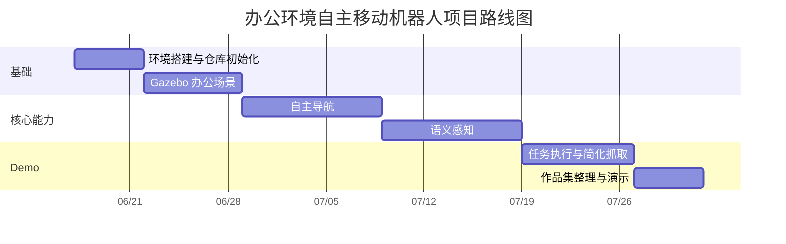

# 办公环境自主移动机器人项目路线图

## 1. 路线图总览

项目按 6 个阶段推进。每个阶段都要形成可验收成果，并进行 Git 提交。路线图优先保证第一次做项目时能稳步完成，不把复杂功能一次性塞进首版。



时间可以根据课程或简历投递节奏调整。建议总周期控制在 6 到 8 周。

## 2. 阶段一：环境搭建与仓库初始化

目标：建立可开发、可运行、可提交的基础环境。

预计时间：3 到 5 天。

任务：

- 安装 Ubuntu 20.04。
- 安装 ROS Noetic、Gazebo Classic、RViz。
- 安装 TurtleBot3 和 TurtleBot3 仿真包。
- 创建 catkin 工作空间。
- 初始化 Git 仓库，完成第一次提交。
- 创建 README、docs、src、assets、scripts 基础目录。

验收标准：

- `roscore` 能启动。
- TurtleBot3 Gazebo demo 能启动。
- RViz 能显示机器人模型、TF 和传感器数据。
- 仓库中有清晰 README 和第一次提交记录。

推荐提交：

```text
chore: initialize project repository
docs: add project plan and architecture docs
```

## 3. 阶段二：Gazebo 办公场景

目标：搭建可用于导航和目标识别的办公仿真环境。

预计时间：5 到 7 天。

任务：

- 创建 office world。
- 放置 TurtleBot3 Waffle Pi。
- 添加墙体、桌椅、通道、障碍物。
- 添加瓶子、文件夹、箱子等目标物体。
- 配置仿真相机和激光雷达。
- 保存 Gazebo 场景截图。

验收标准：

- Gazebo 场景能稳定启动。
- 机器人起点、目标点、配送点位置合理。
- 场景中至少有 2 类可识别物体。
- README 中加入场景截图。

推荐提交：

```text
sim: add office gazebo world
sim: add target objects and robot spawn config
```

## 4. 阶段三：自主导航

目标：机器人可以在办公环境中自主移动、避障、到达多个目标点并返回起点。

预计时间：7 到 10 天。

任务：

- 使用仿真环境生成或准备办公地图。
- 配置 `map_server`。
- 配置 `amcl` 定位。
- 配置 `move_base` 全局规划和局部规划。
- 编写 `navigation_manager_node`。
- 支持至少 3 个目标点。
- 支持任务结束后返回起点。

验收标准：

- RViz 中能看到地图、机器人位姿、全局路径、局部路径。
- 机器人能到达 3 个预设目标点。
- 遇到静态障碍物时能绕行。
- 机器人能返回起点。

推荐提交：

```text
nav: add map and navigation launch files
nav: implement multi-goal navigation manager
nav: add return-home behavior
```

## 5. 阶段四：语义感知

目标：机器人能识别办公环境中的目标物体，并把识别结果转成 ROS topic。

预计时间：7 到 10 天。

任务：

- 订阅 `/camera/rgb/image_raw`。
- 使用 `cv_bridge` 将 ROS 图像转为 OpenCV 图像。
- 第一版用 OpenCV 规则识别目标。
- 发布 `/detected_objects`。
- 添加调试图像 `/perception/debug_image`。
- 第二版接入 YOLOv8n，提高展示效果。

验收标准：

- 能识别至少 2 类物体。
- 检测结果包含类别、置信度和图像坐标。
- 检测结果能被任务节点订阅。
- README 中加入检测截图。

推荐提交：

```text
perception: subscribe camera image and publish detections
perception: add opencv target detection baseline
perception: integrate yolo detection demo
```

## 6. 阶段五：任务执行与简化抓取

目标：把导航和感知串成完整任务流。

预计时间：6 到 8 天。

任务：

- 编写 `task_manager_node`。
- 接收 `/detected_objects`。
- 根据目标类别选择取货点和送达点。
- 调用导航模块前往目标附近。
- 模拟拾取、携带、放置。
- 发布 `/task_state`。
- 通过 RViz Marker 展示任务状态和目标状态。

验收标准：

- 检测到目标后能自动触发任务。
- 机器人能前往目标点。
- 任务状态能从 `IDLE` 正常流转到 `DONE`。
- 机器人能完成送达并返回起点。
- demo 录屏中能看懂完整流程。

推荐提交：

```text
task: add pick-and-deliver state machine
task: connect perception result to navigation goals
viz: add task state markers
```

## 7. 阶段六：作品集整理与演示

目标：把项目整理成可以投简历、展示和答辩的形式。

预计时间：3 到 5 天。

任务：

- 完善 README。
- 补充运行命令。
- 添加架构图、模块说明、Topic 表。
- 添加 Gazebo、RViz、目标检测、完整任务流截图。
- 录制 1 到 3 分钟完整 demo 视频。
- 整理项目亮点和后续优化方向。

验收标准：

- README 能独立说明项目价值和运行方式。
- 仓库结构清晰。
- 演示视频能完整展示导航、识别、任务执行。
- Git 提交历史能体现阶段推进。

推荐提交：

```text
docs: polish portfolio readme
docs: add demo screenshots and video link
```

## 8. 优先级

必须完成：

- ROS Noetic 环境。
- Gazebo 办公场景。
- TurtleBot3 自主导航。
- 至少 2 类目标识别。
- 任务状态机。
- 简化拾取配送闭环。
- README、截图、演示视频。

可以后续增强：

- YOLO 自定义训练。
- 自定义 ROS message。
- MoveIt 机械臂仿真。
- 真实机器人迁移。
- 多机器人协作。
- Web 可视化控制台。

## 9. 每周检查清单

每周结束时检查：

- 本周功能是否能运行。
- 是否有截图或录屏记录。
- 是否提交 Git。
- README 是否同步更新。
- 是否出现新的风险。
- 下周目标是否足够具体。

## 10. 完成定义

项目完成需要同时满足：

- 一条命令或清晰命令组可以启动完整 demo。
- Gazebo 中机器人能执行任务。
- RViz 中可以看到路径、目标和任务状态。
- 感知模块能触发任务。
- README 中有项目介绍、架构、运行方式、截图、视频链接。
- Git 提交历史清楚展示开发过程。
